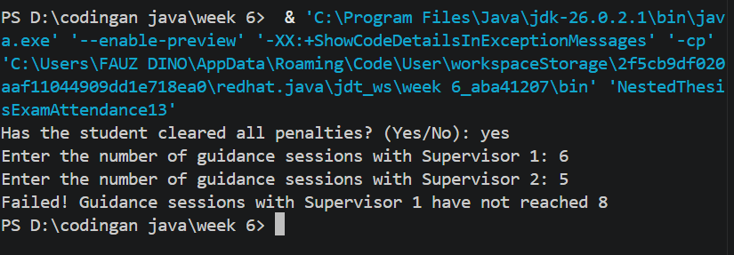
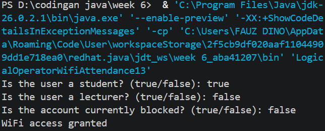
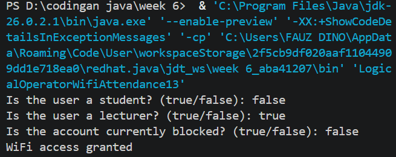
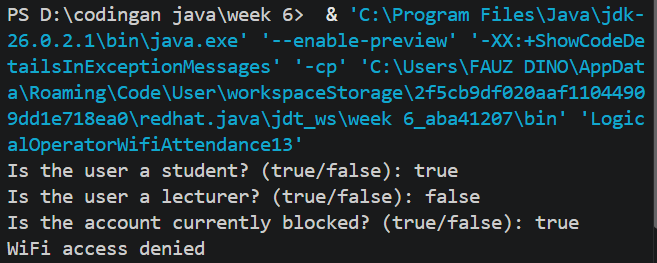
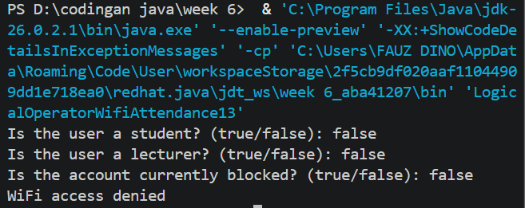
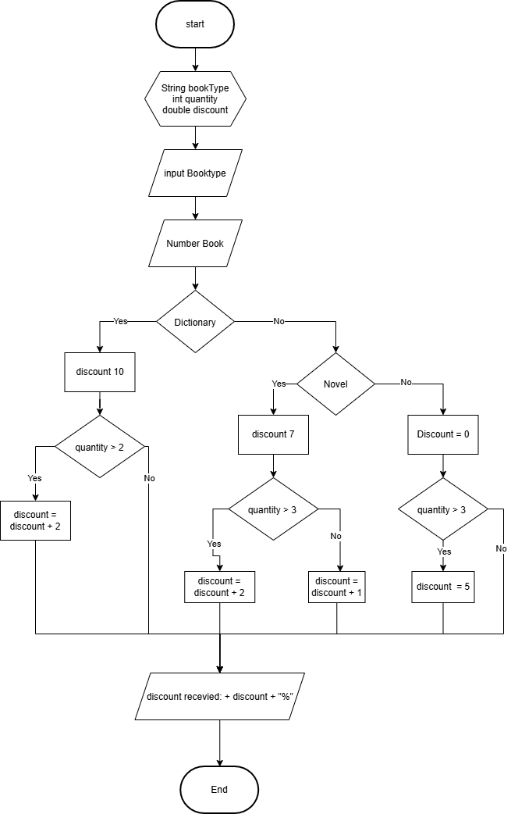
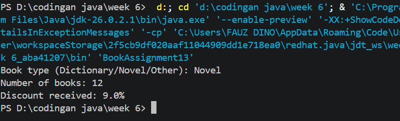
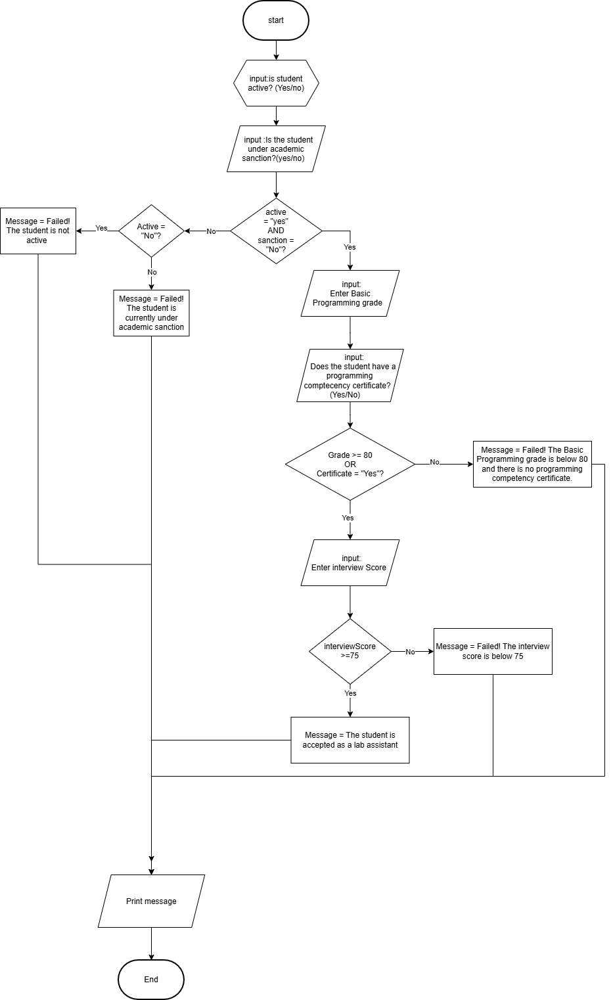
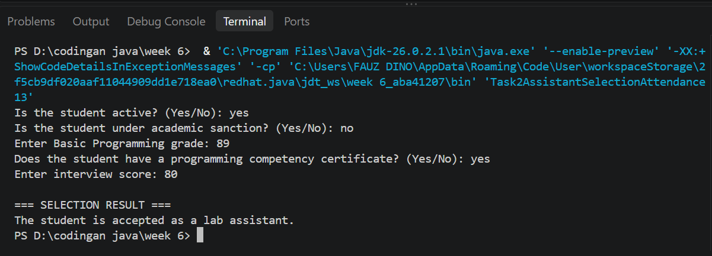

<div align="center">


# Basic Programming Practicum Report
## Session 6: Selection Statements 2

**Department of Information Technology — Politeknik Negeri Malang — 2026/2027**

</div>

| | |
|---|---|
| **Name** | Fauz Dino |
| **NIM** | 264107020241 |
| **Study Program** | D-IV Informatics Engineering |
| **Class** | 1I |

---

## Table of Contents

- [Objectives](#objectives)
- [Project Structure](#project-structure)
- [How to Run](#how-to-run)
- [Experiment 1: Nested IF — Thesis Exam Eligibility](#experiment-1-nested-if--thesis-exam-eligibility)
- [Experiment 2: Logical Operators — Campus WiFi Access](#experiment-2-logical-operators--campus-wifi-access)
- [Experiment 3: Nested IF and Logical Operators — Laboratory Access](#experiment-3-nested-if-and-logical-operators--laboratory-access)
- [Assignment 1: Bookstore Discount](#assignment-1-bookstore-discount)
- [Assignment 2: Lab Assistant Selection](#assignment-2-lab-assistant-selection)

---

## Objectives

1. Solve problems/case studies using selection statement syntax.
2. Implement selection statement syntax in Java programs.
3. Apply the logical operators `&&`, `||`, and `!` within selection structures.

## Project Structure

```text
.
├── README.md
├── code/
│   ├── NestedThesisExamAttendance13.java
│   ├── LogicalOperatorWifiAttendance13.java
│   ├── NestedLabAccessAttendance13.java
│   ├── BookAssignment13.java
│   └── Task2AssistantSelectionAttendance13.java
└── images/
    ├── logo-polinema.png
    ├── exp1-output.png
    ├── exp2-output-1-student.png
    ├── exp2-output-2-lecturer.png
    ├── exp2-output-3-blocked.png
    ├── exp2-output-4-none.png
    ├── assignment1-flowchart.png
    ├── assignment1-output.png
    ├── assignment2-flowchart.png
    └── assignment2-output.png
```

## How to Run

Requires JDK 11 or newer.

```bash
cd code
javac NestedThesisExamAttendance13.java
java NestedThesisExamAttendance13
```

Replace the file name with any other program in the `code/` folder. With JDK 11+, you can also run a file directly: `java BookAssignment13.java`.

---

## Experiment 1: Nested IF — Thesis Exam Eligibility

A student can register for the thesis exam only if all penalties are cleared, and they have at least **8** guidance sessions with Supervisor 1 and at least **4** with Supervisor 2.

### Source code

`code/NestedThesisExamAttendance13.java`

```java
import java.util.Scanner;
public class NestedThesisExamAttendance13 {
    public static void main(String[] args) {
        Scanner sc = new Scanner(System.in);

        String message;

        System.out.print("Has the student cleared all penalties? (Yes/No): ");
        String noPenalty = sc.nextLine().trim();

        System.out.print("Enter the number of guidance sessions with Supervisor 1: ");
        int guidanceCount1 = sc.nextInt();

        System.out.print("Enter the number of guidance sessions with Supervisor 2: ");
        int guidanceCount2 = sc.nextInt();

        if (noPenalty.equalsIgnoreCase("Yes")) {
            if (guidanceCount1 >= 8 && guidanceCount2 >= 4) {
                message = "All requirements met. The student may register for the thesis exam";
            } else if (guidanceCount1 < 8 && guidanceCount2 < 4) {
                message = "Failed! Guidance sessions with Supervisor 1 are below 8 and Supervisor 2 are below 4";
            } else if (guidanceCount1 < 8) {
                message = "Failed! Guidance sessions with Supervisor 1 have not reached 8";
            } else {
                message = "Failed! Guidance sessions with Supervisor 2 have not reached 4";
            }
            } else {
                message = "Failed! The student still has an outstanding penalty";
            }
            System.out.println(message);

            sc.close();
    }
    
}
```

### Output

Input: penalties cleared = `yes`, Supervisor 1 = `6`, Supervisor 2 = `5`.



### Questions

**1. What happens if a student answers "No" to the question regarding the compensation waiver? Why?**

The program prints `Failed! The student still has an outstanding penalty`. The guidance-session checks are nested inside the `if` that tests the penalty status, so when the answer is not "Yes" the program skips them and goes straight to the `else` branch.

**2. Explain the purpose of the following code snippet.**

```java
if (guidanceCount1 >= 8 && guidanceCount2 >= 4)
```

It executes the enclosed block only if `guidanceCount1` is 8 or greater **and** `guidanceCount2` is 4 or greater at the same time. If either one is not met, the condition is false.

**3. What is the workflow for checking student requirements from start to finish?**

1. The program reads the penalty status and the number of guidance sessions with Supervisor 1 and Supervisor 2.
2. It checks the penalty status. If it is not "Yes", the message is `Failed! The student still has an outstanding penalty`.
3. If it is "Yes", it checks the guidance sessions:
   - Supervisor 1 ≥ 8 **and** Supervisor 2 ≥ 4 → the student may register for the thesis exam.
   - Both are below the minimum → the message reports both shortfalls.
   - Only Supervisor 1 is below 8 → the message reports Supervisor 1.
   - Otherwise (only Supervisor 2 is below 4) → the message reports Supervisor 2.
4. The final message is printed.

---

## Experiment 2: Logical Operators — Campus WiFi Access

WiFi access is granted to a student or a lecturer whose account is not blocked: `(isStudent || isLecturer) && !isBlocked`.

### Source code

`code/LogicalOperatorWifiAttendance13.java`

```java
import java.util.Scanner;
public class LogicalOperatorWifiAttendance13 {
    public static void main(String[] args) {
        Scanner sc = new Scanner(System.in);

        boolean isStudent;
        boolean isLecturer;
        boolean isBlocked;

        System.out.print("Is the user a student? (true/false): ");
        isStudent = sc.nextBoolean();

        System.out.print("Is the user a lecturer? (true/false): ");
        isLecturer = sc.nextBoolean();

        System.out.print("Is the account currently blocked? (true/false): ");
        isBlocked = sc.nextBoolean();

        if ((isStudent| isLecturer) && !isBlocked) {
            System.out.println("WiFi access granted");
        } else {
            System.out.println("WiFi access denied");
        }
        sc.close();
    }
}
```

### Output

| Student | Lecturer | Blocked | Result | Screenshot |
|:---:|:---:|:---:|---|---|
| true | false | false | WiFi access granted |  |
| false | true | false | WiFi access granted |  |
| true | false | true | WiFi access denied |  |
| false | false | false | WiFi access denied |  |

### Questions

**1. Explain the function of the `||`, `&&`, and `!` operators in the condition above.**

- `||` (OR) returns `true` if at least one of the conditions is true.
- `&&` (AND) returns `true` only if both the left and right conditions are true.
- `!` (NOT) inverts a boolean value: `true` becomes `false` and vice versa.

**2. Why can a lecturer still get access when `isStudent = false`?**

Because `isStudent` and `isLecturer` are joined with OR. Even if `isStudent` is false, `isLecturer` is true, so `isStudent || isLecturer` evaluates to true. As long as the account is not blocked, `!isBlocked` is also true and access is granted.

**3. Change `||` to `&&` and run test data 1 and 2. What happens, and why?**

Test 1 (student = true, lecturer = false) and test 2 (student = false, lecturer = true) both print `WiFi access denied`. With `&&`, a user would have to be a student **and** a lecturer at the same time, so only one role being true makes the condition false.

**4. In `isStudent || isLecturer`, when does `isLecturer` not need to be evaluated? Explain using short-circuit evaluation.**

When `isStudent` is `true`. An OR expression is already guaranteed to be true, so Java skips evaluating `isLecturer`.

> Note: the code uses the single `|` operator, which is **not** short-circuit and always evaluates both sides. Short-circuit behavior applies to `||`.

**5. In `(isStudent || isLecturer) && !isBlocked`, when does `!isBlocked` not need to be evaluated?**

When `(isStudent || isLecturer)` is `false`. An AND expression with a false left side is guaranteed to be false (`false && anything` is `false`), so with `&&` Java skips `!isBlocked`.

---

## Experiment 3: Nested IF and Logical Operators — Laboratory Access

A student gets laboratory access only if they are an active student, are not sanctioned, and have either a lecturer permit or lab assistant status.

### Source code

`code/NestedLabAccessAttendance13.java`

```java
import java.util.Scanner;
public class NestedLabAccessAttendance13 {
    public static void main(String[] args) {
       Scanner sc = new Scanner(System.in);

        boolean isActiveStudent;
        boolean isSanctioned;
        boolean hasLecturerPermit;
        boolean isLabAssistant;
        
        System.out.println();
        isActiveStudent = sc.nextBoolean();

        System.out.println();
        isSanctioned = sc.nextBoolean();

        System.out.println();
        hasLecturerPermit = sc.nextBoolean();

        System.out.println();
        isLabAssistant = sc.nextBoolean();

        if (isActiveStudent && !isSanctioned) {
            if (hasLecturerPermit || isLabAssistant) {
                System.out.println("Laboratory access granted");
            } 
            else {
                System.out.println("Access denied: lecturer permission or lab assistant status required");
            }
            } 
            else {
                System.out.println("Access denied: student status does not meet the requirement");
            }
            sc.close();
    }
    
}
```

### Output

The program reads four boolean values in this order: `isActiveStudent`, `isSanctioned`, `hasLecturerPermit`, `isLabAssistant`.

| Input | Output |
|---|---|
| `false false true true` | Access denied: student status does not meet the requirement |
| `true false false false` | Access denied: lecturer permission or lab assistant status required |
| `true false true false` | Laboratory access granted |

### Questions

**1. Why is the check `hasLecturerPermit || isLabAssistant` placed inside the first IF?**

That check only matters if the student is active and not sanctioned. If the first condition fails, the student is rejected immediately and the second check is unnecessary.

**2. Explain the function of the `&&`, `||`, and `!` operators in this program.**

- `&&` requires the student to be active **and** not sanctioned.
- `||` requires at least one of the lecturer permit or lab assistant status.
- `!` inverts `isSanctioned`, so "not sanctioned" counts as a pass.

**3. Can the requirement be written as a single condition `isActiveStudent && !isSanctioned && (hasLecturerPermit || isLabAssistant)`? Does the final decision stay the same?**

Yes. Access is still granted only when the student is active, not sanctioned, and has a lecturer permit or is a lab assistant. The final decision is identical.

**4. What is the advantage of Nested IF over a single IF when the system needs to show different reasons for denial?**

Each level of nesting has its own `else` branch, so the program can report a specific reason: the student status does not meet the requirement (first level), or a lecturer permit or lab assistant status is required (second level). A single combined condition can only produce one generic denial.

**5. Create one input combination denied at the first level, and one denied at the second level.**

- First level: `false, false, true, true` (the student is inactive).
- Second level: `true, false, false, false` (active and not sanctioned, but no lecturer permit and not a lab assistant).

---

## Assignment 1: Bookstore Discount

Implement the Week 6 Exercise 2 flowchart for the bookstore discount system as a Java program using Nested IF and logical operators where needed.

| Book type | Base discount | Quantity rule |
|---|---|---|
| Dictionary | 10% | +2% if quantity > 2 |
| Novel | 7% | +2% if quantity > 3, otherwise +1% |
| Other | 0% | 5% if quantity > 3 |

### Flowchart



### Source code

`code/BookAssignment13.java`

```java
import java.util.Scanner;

public class BookAssignment13 {
    public static void main(String[] args) {
        Scanner sc = new Scanner(System.in);

        String bookType;
        int quantity;
        double discount;

        System.out.print("Book type (Dictionary/Novel/Other): ");
        bookType = sc.nextLine();

        System.out.print("Number of books: ");
        quantity = sc.nextInt();

        if (bookType.equalsIgnoreCase("Dictionary")) {
            discount = 10;

            if (quantity > 2) {
                discount = discount + 2;
            }

        } else if (bookType.equalsIgnoreCase("Novel")) {
            discount = 7;

            if (quantity > 3) {
                discount = discount + 2;
            } else {
                discount = discount + 1;
            }

        } else {
            discount = 0;

            if (quantity > 3) {
                discount = 5;
            }
        }

        System.out.println("Discount received: " + discount + "%");

        sc.close();
    }
}
```

### Output

Input: `Novel`, `12` books → 7% + 2% = 9%.



---

## Assignment 2: Lab Assistant Selection

Rules:

1. A student may take part in the selection if they are **active** and **not under academic sanction**.
2. They must also have a **Basic Programming grade ≥ 80** or a **programming competency certificate**.
3. If both requirements are met, the student is interviewed and accepted if the **interview score ≥ 75**.
4. The program shows the reason if the student fails at any stage.

### Flowchart



### Source code

`code/Task2AssistantSelectionAttendance13.java`

```java
import java.util.Scanner;

public class Task2AssistantSelectionAttendance13 {
    public static void main(String[] args) {
        Scanner sc = new Scanner(System.in);

        String message;

        System.out.print("Is the student active? (Yes/No): ");
        String active = sc.nextLine();

        System.out.print("Is the student under academic sanction? (Yes/No): ");
        String sanction = sc.nextLine();

        if (active.equalsIgnoreCase("Yes") && sanction.equalsIgnoreCase("No")) {

            System.out.print("Enter Basic Programming grade: ");
            int grade = sc.nextInt();

            sc.nextLine();

            System.out.print("Does the student have a programming competency certificate? (Yes/No): ");
            String certificate = sc.nextLine();

            if (grade >= 80 || certificate.equalsIgnoreCase("Yes")) {

                System.out.print("Enter interview score: ");
                int interviewScore = sc.nextInt();

                if (interviewScore >= 75) {
                    message = "The student is accepted as a lab assistant.";
                } else {
                    message = "Failed! The interview score is below 75.";
                }

            } else {
                message = "Failed! The Basic Programming grade is below 80 and there is no programming competency certificate.";
            }

        } else if (!active.equalsIgnoreCase("Yes")) {
            message = "Failed! The student is not active.";
        } else {
            message = "Failed! The student is currently under academic sanction.";
        }

        System.out.println("\n=== SELECTION RESULT ===");
        System.out.println(message);

        sc.close();
    }
}
```

### Output

Input: active = `yes`, sanction = `no`, grade = `89`, certificate = `yes`, interview = `80`.



---

<div align="center">

**Fauz Dino** · D-IV Informatics Engineering · Politeknik Negeri Malang

</div>
