# JOBSHEET 6 - SELECTION STATEMENTS 2

**Student Identity:**
* **Name:** Fauz
* **Student ID (NIM):** [NIM]
* **Class / Attendance No.:** [Class] / 13

---

## 1: OBJECTIVES

1. Students can solve problems and case studies using nested selection statements.
2. Students can apply nested selection statements in Java programs.
3. Students can apply the logical operators `&&`, `||`, and `!` in selection structures.

---

## 2: EXPERIMENT RESULTS & ANALYSIS

### 2.1 Experiment 1: Nested IF to Check Thesis Exam Requirements

The program uses a **nested IF** structure to check the requirements for registering for the thesis exam in two levels. At the first level, the `String noPenalty` variable (read with `nextLine().trim()`) is compared with `"Yes"` using `equalsIgnoreCase()`, so the input is case-insensitive. If the student has no outstanding penalty, the program moves to the second level, where the `int` variables `guidanceCount1` and `guidanceCount2` are checked with the `&&` operator. The `else if` branches are used to tell the student exactly which requirement has not been met, and the final `message` is printed once at the end.

#### 2.1.1 Java Program Code
```java
import java.util.Scanner;
public class NestedThesisExamAttendance13 {
    public static void main(String[] args) {
        Scanner sc = new Scanner(System.in);

        String message;

        System.out.print("Has the student cleared all penalties? (Yes/No): ");
        String noPenalty = sc.nextLine().trim();

        System.out.print("Enter the number of guidance sessions with Supervisor 1: ");
        int guidanceCount1 = sc.nextInt();

        System.out.print("Enter the number of guidance sessions with Supervisor 2: ");
        int guidanceCount2 = sc.nextInt();

        if (noPenalty.equalsIgnoreCase("Yes")) {
            if (guidanceCount1 >= 8 && guidanceCount2 >= 4) {
                message = "All requirements met. The student may register for the thesis exam";
            } else if (guidanceCount1 < 8 && guidanceCount2 < 4) {
                message = "Failed! Guidance sessions with Supervisor 1 are below 8 and Supervisor 2 are below 4";
            } else if (guidanceCount1 < 8) {
                message = "Failed! Guidance sessions with Supervisor 1 have not reached 8";
            } else {
                message = "Failed! Guidance sessions with Supervisor 2 have not reached 4";
            }
            } else {
                message = "Failed! The student still has an outstanding penalty";
            }
            System.out.println(message);

            sc.close();
    }
    
}
```

#### 2.1.2 Running Result / Output Screenshot

Output required by the jobsheet (`yes`, `6`, `5`):

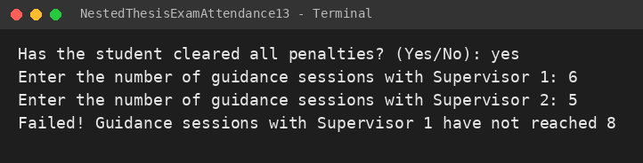

Additional test runs so that every possible output appears at least once:

| Input (penalty, guidance 1, guidance 2) | Output Screenshot |
| :--- | :--- |
| `Yes`, `8`, `4` (all requirements met) | 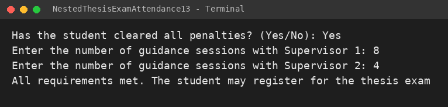 |
| `No`, `9`, `5` (outstanding penalty) | 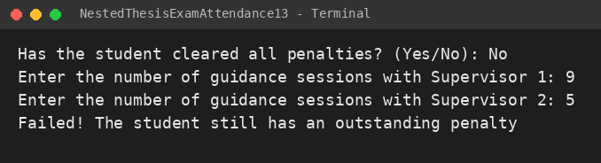 |
| `Yes`, `5`, `2` (both below minimum) | 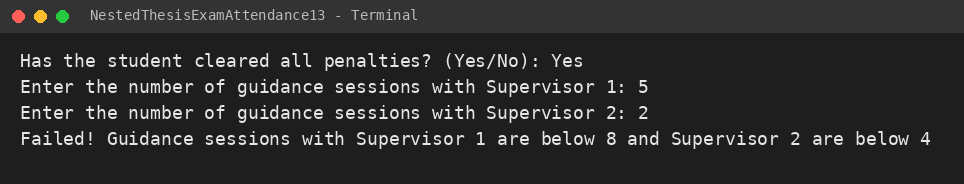 |
| `Yes`, `9`, `2` (Supervisor 2 below minimum) | 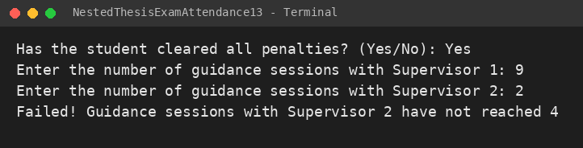 |

#### 2.1.3 Answers to Questions

1. **What happens if the student answers "No" to the penalty-clearance question? Why?**
   * **Answer:** The condition `noPenalty.equalsIgnoreCase("Yes")` becomes `false`, so the program skips the whole inner IF block and runs the outer `else`, which sets `message = "Failed! The student still has an outstanding penalty"`. This happens because the guidance check is nested inside the first IF: the administrative requirement is a prerequisite, so the guidance log is not evaluated at all when it is not met (even if the student has enough guidance sessions, e.g. 9 and 5).

2. **Explain the meaning of the following code snippet!** `if (guidanceCount1 >= 8 && guidanceCount2 >= 4) {`
   * **Answer:** The condition is `true` only if **both** parts are true at the same time: the student has at least 8 guidance sessions with Supervisor 1 (`guidanceCount1 >= 8`) **and** at least 4 sessions with Supervisor 2 (`guidanceCount2 >= 4`). The `&&` (AND) operator returns `false` if either one is not fulfilled.

3. **Describe the full flow of checking the student's requirements from start to finish.**
   * **Answer:**
     1. The program reads the penalty status, then the number of guidance sessions with Supervisor 1 and Supervisor 2.
     2. **Level 1:** `noPenalty.equalsIgnoreCase("Yes")`. If `false`, the message is "Failed! The student still has an outstanding penalty" and the program goes to the print statement.
     3. If `true`, **Level 2** starts. The first condition is `guidanceCount1 >= 8 && guidanceCount2 >= 4`. If `true`, the message is "All requirements met. The student may register for the thesis exam".
     4. If not, `guidanceCount1 < 8 && guidanceCount2 < 4` is checked. If `true`, both supervisors' guidance sessions are below the minimum.
     5. If not, `guidanceCount1 < 8` is checked. If `true`, only Supervisor 1's sessions are insufficient.
     6. If none of the above is true, the only remaining possibility is that Supervisor 2's sessions are below 4, handled by the last `else`.
     7. `System.out.println(message)` prints the final message.

---

### 2.2 Experiment 2: Logical Operators to Determine Campus WiFi Access

This program practices the logical operators. Three `boolean` variables (`isStudent`, `isLecturer`, `isBlocked`) are read using `nextBoolean()`. The condition `(isStudent || isLecturer) && !isBlocked` grants access if the user is a student **or** a lecturer **and** the account is **not** blocked. The parentheses are important so that `||` is evaluated first before `&&`.

#### 2.2.1 Java Program Code
```java
import java.util.Scanner;
public class LogicalOperatorWifiAttendance13 {
    public static void main(String[] args) {
        Scanner sc = new Scanner(System.in);

        boolean isStudent;
        boolean isLecturer;
        boolean isBlocked;

        System.out.print("Is the user a student? (true/false): ");
        isStudent = sc.nextBoolean();

        System.out.print("Is the user a lecturer? (true/false): ");
        isLecturer = sc.nextBoolean();

        System.out.print("Is the account currently blocked? (true/false): ");
        isBlocked = sc.nextBoolean();

        if ((isStudent || isLecturer) && !isBlocked) {
            System.out.println("WiFi access granted");
        } else {
            System.out.println("WiFi access denied");
        }
        sc.close();
    }
}
```

#### 2.2.2 Test Results

| Test | isStudent | isLecturer | isBlocked | Output | Screenshot |
| :---: | :---: | :---: | :---: | :--- | :---: |
| 1 | `true` | `false` | `false` | WiFi access granted | 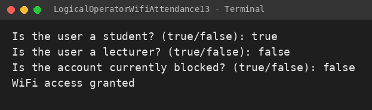 |
| 2 | `false` | `true` | `false` | WiFi access granted | 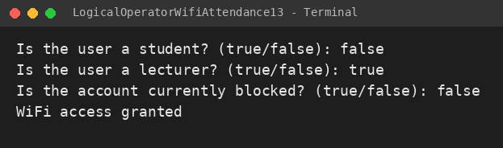 |
| 3 | `true` | `false` | `true` | WiFi access denied | 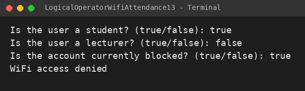 |
| 4 | `false` | `false` | `false` | WiFi access denied | 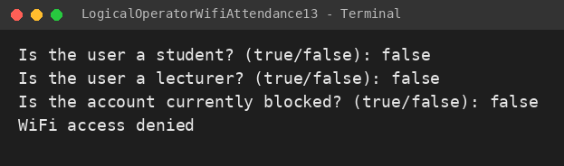 |

#### 2.2.3 Answers to Questions

1. **Explain the function of the `||`, `&&`, and `!` operators in the condition above.**
   * **Answer:**
     * `||` (OR): `true` if at least one operand is `true`. Here it checks that the user is a student or a lecturer.
     * `&&` (AND): `true` only if both operands are `true`. Here it requires the user type to be valid and the account to be unblocked.
     * `!` (NOT): reverses a boolean value. `!isBlocked` is `true` when the account is *not* blocked.

2. **Why can a lecturer still get access when `isStudent = false`?**
   * **Answer:** Because `isStudent || isLecturer` only needs one operand to be `true`. With `isStudent = false` and `isLecturer = true`, the result is `true`, and if the account is not blocked the whole condition is `true` (Test 2).

3. **Change `||` to `&&`. Run the program again using test data 1 and 2. What happens, and why?**
   * **Answer:** Both tests become **"WiFi access denied"**. Test 1 gives `(true && false) && true` = `false`, and Test 2 gives `(false && true) && true` = `false`. With `&&`, the user must be a student **and** a lecturer at the same time, which normally does not happen, so valid users are rejected.

4. **In the expression `isStudent || isLecturer`, when does `isLecturer` not need to be evaluated? Explain using short-circuit evaluation.**
   * **Answer:** When `isStudent` is `true`. Since `true || anything` is always `true`, Java stops evaluating and skips `isLecturer` (short-circuit evaluation). `isLecturer` is only evaluated when `isStudent` is `false`.

5. **In the expression `(isStudent || isLecturer) && !isBlocked`, when does `!isBlocked` not need to be evaluated? Explain.**
   * **Answer:** When `(isStudent || isLecturer)` is `false` (the user is neither a student nor a lecturer, Test 4). Since `false && anything` is always `false`, `!isBlocked` is skipped and the result is immediately `false`.

---

### 2.3 Experiment 3: Nested IF and Logical Operators to Determine Laboratory Access

This program combines nested selection with logical operators. The first level checks that the student is active **and** not sanctioned (`isActiveStudent && !isSanctioned`). If this passes, the second level checks whether the student has lecturer permission **or** is a lab assistant (`hasLecturerPermit || isLabAssistant`). Each failure point prints a different denial reason.

> Note: the `System.out.println()` calls before each `nextBoolean()` were empty in the original file, so the program showed no prompts. They were replaced with `System.out.print("...")` prompts so the input is clear when running.

#### 2.3.1 Java Program Code
```java
import java.util.Scanner;
public class NestedLabAccessAttendance13 {
    public static void main(String[] args) {
       Scanner sc = new Scanner(System.in);

        boolean isActiveStudent;
        boolean isSanctioned;
        boolean hasLecturerPermit;
        boolean isLabAssistant;
        
        System.out.print("Is the student active? (true/false): ");
        isActiveStudent = sc.nextBoolean();

        System.out.print("Is the student currently sanctioned? (true/false): ");
        isSanctioned = sc.nextBoolean();

        System.out.print("Does the student have lecturer permission? (true/false): ");
        hasLecturerPermit = sc.nextBoolean();

        System.out.print("Is the student a lab assistant? (true/false): ");
        isLabAssistant = sc.nextBoolean();

        if (isActiveStudent && !isSanctioned) {
            if (hasLecturerPermit || isLabAssistant) {
                System.out.println("Laboratory access granted");
            } 
            else {
                System.out.println("Access denied: lecturer permission or lab assistant status required");
            }
            } 
            else {
                System.out.println("Access denied: student status does not meet the requirement");
            }
            sc.close();
    }
    
}
```

#### 2.3.2 Test Results

| Test | isActiveStudent | isSanctioned | hasLecturerPermit | isLabAssistant | Output | Screenshot |
| :---: | :---: | :---: | :---: | :---: | :--- | :---: |
| 1 | `true` | `false` | `true` | `false` | Laboratory access granted | 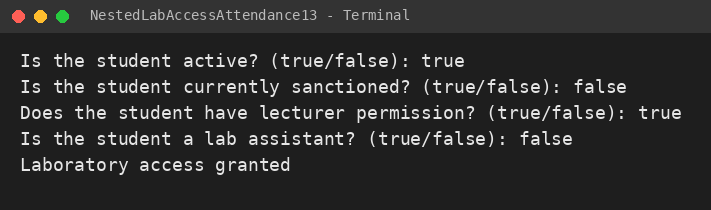 |
| 2 | `true` | `false` | `false` | `true` | Laboratory access granted | 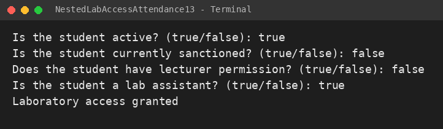 |
| 3 | `true` | `false` | `false` | `false` | Access denied: lecturer permission or lab assistant status required | 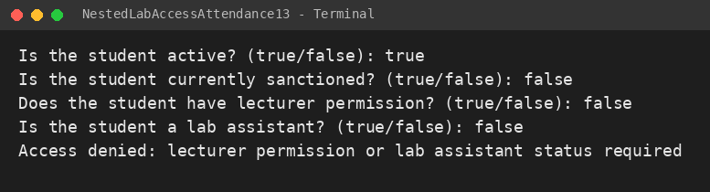 |
| 4 | `false` | `false` | `true` | `true` | Access denied: student status does not meet the requirement | 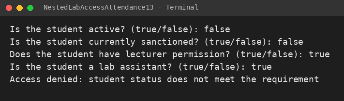 |
| 5 | `true` | `true` | `true` | `true` | Access denied: student status does not meet the requirement | 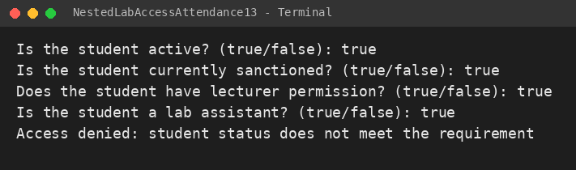 |

#### 2.3.3 Answers to Questions

1. **Why is the check `hasLecturerPermit || isLabAssistant` placed inside the first IF?**
   * **Answer:** Because it is a second requirement that only matters if the student is already eligible (active and not sanctioned). A student who fails the first requirement should be denied regardless of permission or assistant status, so the second check is only run inside the first IF.

2. **Explain the function of the `&&`, `||`, and `!` operators in this program.**
   * **Answer:** `&&` in `isActiveStudent && !isSanctioned` requires both conditions to be true. `!` in `!isSanctioned` makes the condition true when the student is *not* sanctioned. `||` in `hasLecturerPermit || isLabAssistant` accepts either lecturer permission or lab assistant status.

3. **Can the access requirement be written as a single condition: `isActiveStudent && !isSanctioned && (hasLecturerPermit || isLabAssistant)`? Explain whether the final access decision stays the same.**
   * **Answer:** Yes. The single condition is logically equivalent, so the final decision (granted or denied) is the same for every input combination. The difference is that a single `if-else` can only produce one "denied" message and cannot tell which requirement failed.

4. **What is the advantage of using Nested IF in this case, compared to a single IF, if the system needs to show different reasons for denial?**
   * **Answer:** Nested IF separates the requirement levels, so each level has its own `else` with a specific message ("student status does not meet the requirement" vs. "lecturer permission or lab assistant status required"). The user gets clear feedback, and the code is easier to read and extend.

5. **Create one input combination that causes access to be denied at the first level, and one that causes it to be denied at the second level.**
   * **Answer:**
     * First level: `isActiveStudent = false`, `isSanctioned = false`, `hasLecturerPermit = true`, `isLabAssistant = true` (Test 4). Output: *Access denied: student status does not meet the requirement*.
     * Second level: `isActiveStudent = true`, `isSanctioned = false`, `hasLecturerPermit = false`, `isLabAssistant = false` (Test 3). Output: *Access denied: lecturer permission or lab assistant status required*.

---

## 3: ASSIGNMENT

### 3.1 Assignment 1: Bookstore Discount System (Nested IF)

The program reads the book type and the number of books, then determines the discount using nested IF. The type is compared with `equalsIgnoreCase()`, and the inner IF adjusts the discount based on quantity:

| Book Type | Base Discount | Additional Rule |
| :--- | :---: | :--- |
| Dictionary | 10% | +2% if more than 2 books |
| Novel | 7% | +2% if more than 3 books, otherwise +1% |
| Other | 0% | 5% if more than 3 books |

> Flowchart: `[insert your Exercise 2 Week 6 flowchart image here: images/flowchart_bookstore.png]`

#### 3.1.1 Java Program Code
```java
import java.util.Scanner;

public class BookAssignment13 {
    public static void main(String[] args) {
        Scanner sc = new Scanner(System.in);

        String bookType;
        int quantity;
        double discount;

        System.out.print("Book type (Dictionary/Novel/Other): ");
        bookType = sc.nextLine();

        System.out.print("Number of books: ");
        quantity = sc.nextInt();

        if (bookType.equalsIgnoreCase("Dictionary")) {
            discount = 10;

            if (quantity > 2) {
                discount = discount + 2;
            }

        } else if (bookType.equalsIgnoreCase("Novel")) {
            discount = 7;

            if (quantity > 3) {
                discount = discount + 2;
            } else {
                discount = discount + 1;
            }

        } else {
            discount = 0;

            if (quantity > 3) {
                discount = 5;
            }
        }

        System.out.println("Discount received: " + discount + "%");

        sc.close();
    }
}
```

#### 3.1.2 Running Result

| Input | Expected | Screenshot |
| :--- | :--- | :---: |
| `Dictionary`, `3` | 10 + 2 = 12% | 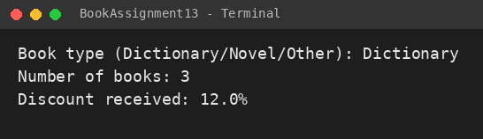 |
| `Novel`, `2` | 7 + 1 = 8% | 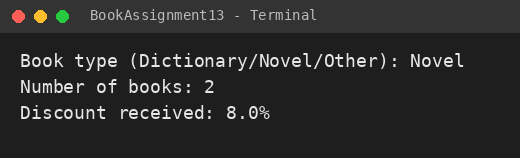 |
| `Other`, `5` | 5% |  |

---

### 3.2 Assignment 2: Lab Assistant Candidate Selection

The program has three selection stages in a nested IF:

1. **Stage 1:** the student must be active and not under academic sanction (`active == "Yes" && sanction == "No"`). If it fails, `else if` / `else` decide whether the reason is inactivity or sanction.
2. **Stage 2:** Basic Programming grade of at least 80 **or** a programming competency certificate (`grade >= 80 || certificate == "Yes"`).
3. **Stage 3:** the interview score must be at least 75.

Each failure sets a specific reason in `message`, and the result is printed once at the end. `sc.nextLine()` is called after `nextInt()` to consume the leftover newline so the certificate input is not skipped.

#### 3.2.1 Java Program Code
```java
import java.util.Scanner;

public class Task2AssistantSelectionAttendance13 {
    public static void main(String[] args) {
        Scanner sc = new Scanner(System.in);

        String message;

        System.out.print("Is the student active? (Yes/No): ");
        String active = sc.nextLine();

        System.out.print("Is the student under academic sanction? (Yes/No): ");
        String sanction = sc.nextLine();

        if (active.equalsIgnoreCase("Yes") && sanction.equalsIgnoreCase("No")) {

            System.out.print("Enter Basic Programming grade: ");
            int grade = sc.nextInt();

            sc.nextLine();

            System.out.print("Does the student have a programming competency certificate? (Yes/No): ");
            String certificate = sc.nextLine();

            if (grade >= 80 || certificate.equalsIgnoreCase("Yes")) {

                System.out.print("Enter interview score: ");
                int interviewScore = sc.nextInt();

                if (interviewScore >= 75) {
                    message = "The student is accepted as a lab assistant.";
                } else {
                    message = "Failed! The interview score is below 75.";
                }

            } else {
                message = "Failed! The Basic Programming grade is below 80 and there is no programming competency certificate.";
            }

        } else if (!active.equalsIgnoreCase("Yes")) {
            message = "Failed! The student is not active.";
        } else {
            message = "Failed! The student is currently under academic sanction.";
        }

        System.out.println("\n=== SELECTION RESULT ===");
        System.out.println(message);

        sc.close();
    }
}
```

#### 3.2.2 Running Result

| Scenario | Screenshot |
| :--- | :---: |
| Accepted (grade 85, interview 80) | 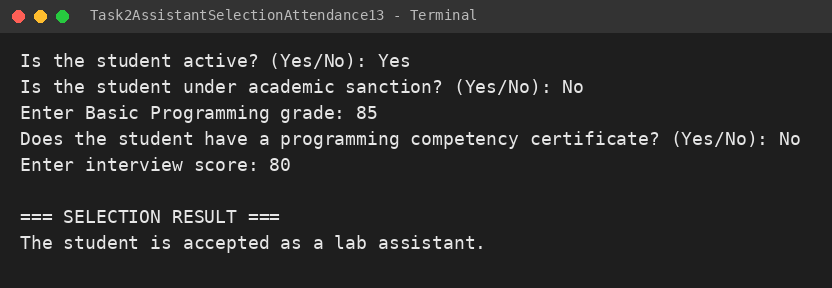 |
| Failed at interview (score 60) | 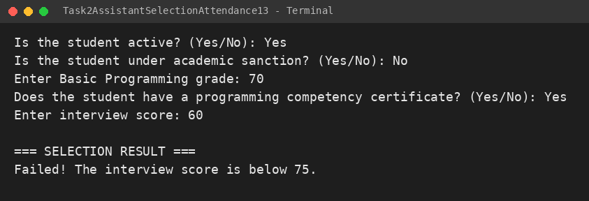 |
| Grade below 80 and no certificate | 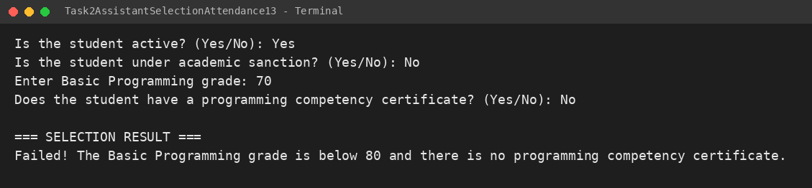 |
| Student not active | 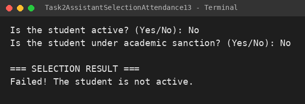 |
| Student under sanction | 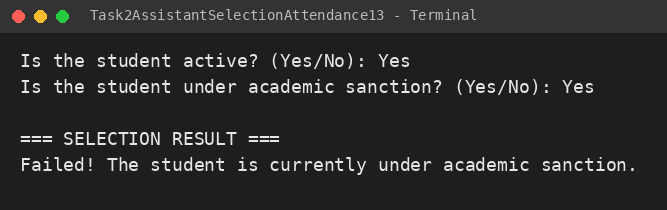 |

---

## 4: CONCLUSION

Nested selection statements allow a program to check requirements in stages, so each stage is only evaluated when the previous one is satisfied, and every failure can produce its own specific message. The logical operators `&&`, `||`, and `!` combine several conditions into one expression, and short-circuit evaluation stops the evaluation as soon as the result is already known. Combining nested IF with logical operators, as in the laboratory access and lab-assistant selection programs, keeps the logic readable while still giving clear feedback to the user.
